# Canny Edge Detector — Architecture (rev 2, AXI4-Stream)

## Revision note

Rev 1 (flat `valid`/`data`, no backpressure, single `src/`+`doc/` layout) is
superseded. Two requirements changed the design after rev 1:

1. `canny_top`'s boundary ports must be AXI4-Stream.
2. Per `shared/Axi4.md` ("Mandatory default for streaming data") and explicit
   user direction: **every** inter-stage link, not just the top-level
   boundary, must be a real AXI4-Stream link with working backpressure
   (`TREADY`) — no global stall/clock-enable shortcut.

The project also moved from a flat `src/`/`doc/` layout to the tsfpga/
hdl-modules module convention: one folder per module under `/modules`, each
with `src/`, `test/`, `doc/`, optionally `module_<name>.py`, `readme.rst`.
This document stays at the repo-level `doc/` (mirrors `ddoc/<ip>_arch.md`
from the tsfpga skill convention, using this project's `doc/` naming).
Per-module requirement/proposal/doc files live under
`modules/<name>/doc/<name>_{req,proposal}.md` and `modules/<name>/doc/<name>.md`.

Per `shared/ReusableRTL.md`, existing modules are reused unmodified wherever
possible; new RTL is written only for behavior that doesn't already exist
in the project or its vendored dependency (`hdl-modules`).

## Intent

A streaming, raster-scan Canny edge detector for 8-bit grayscale video-like
pixel streams, exposed as an AXI4-Stream slave (input) and AXI4-Stream
master (output), with full backpressure through every internal stage.
Single clock domain.

## Frame framing convention

AXI4-Stream has one native packet marker (`TLAST`). A 2D raster image needs
two: end-of-line and end-of-frame. This design uses the common
Xilinx-video-protocol convention (reused rather than invented):

- `TLAST` = end-of-line (EOL): last pixel of a row.
- `TUSER(0)` = start-of-frame (SOF): first pixel of a new frame.

End-of-frame is derived, not signalled separately: it is the EOL pulse on
the last row (row `g_img_height - 1`), which every module can recognize
from its own internal row counter without needing a third sideband bit.

## Top-level generics

| Generic | Type | Purpose |
|---|---|---|
| `g_img_width` | positive | frame width in pixels |
| `g_img_height` | positive | frame height in pixels |
| `g_thresh_low` | natural | hysteresis low threshold (magnitude units) |
| `g_thresh_high` | natural | hysteresis high threshold (magnitude units) |

## Top-level ports (flat AXI4-Stream)

Flat ports at the IP boundary per `shared/InterfaceRecords.md` ("flat ports
... when ... external integration tooling cannot consume records cleanly" —
true for a synthesizable top-level meant to drop into an IP-integrator-style
flow). Internally, every link is an `axi_stream_m2s_t`/`axi_stream_s2m_t`
record pair reused directly from hdl-modules' `axi_stream_pkg` (no new
record types invented) — a thin pack/unpack wrapper at the top level
converts flat to record.

| Port | Dir | Type | Purpose |
|---|---|---|---|
| `clk` | in | std_logic | single clock domain |
| `rst_n` | in | std_logic | synchronous active-low reset |
| `s_axis_tvalid` | in | std_logic | input pixel valid |
| `s_axis_tready` | out | std_logic | backpressure to producer |
| `s_axis_tdata` | in | std_logic_vector(7 downto 0) | 8-bit grayscale pixel, raster order |
| `s_axis_tlast` | in | std_logic | end-of-line |
| `s_axis_tuser` | in | std_logic_vector(0 downto 0) | bit 0 = start-of-frame |
| `m_axis_tvalid` | out | std_logic | output valid |
| `m_axis_tready` | in | std_logic | backpressure from consumer |
| `m_axis_tdata` | out | std_logic_vector(7 downto 0) | bit 0 = edge ('1'/'0'), bits 7:1 = '0' |
| `m_axis_tlast` | out | std_logic | end-of-line, re-derived through the pipeline's own row/col counters |
| `m_axis_tuser` | out | std_logic_vector(0 downto 0) | bit 0 = start-of-frame, re-derived the same way |

Border pixels are not dropped — see "Growing border" below; they are
reported with `TDATA(0) = '0'`.

## Submodule table

| Module | Responsibility | New/reuse | Source |
|---|---|---|---|
| `axi_stream_join` | Generic 2-input AXI-Stream rendezvous: emits a joined transfer only when both inputs are valid, applying combined backpressure to both. Used to resynchronize the Sobel magnitude/direction forks before NMS without assuming equal per-branch latency. | new, generic (not canny-specific) | `modules/axi_stream_join/src/axi_stream_join.vhd` |
| `axi_stream_fifo` | Elastic buffering for the Sobel direction-sideband fork | reuse, unmodified | `hdl-modules/modules/axi_stream/src/axi_stream_fifo.vhd` |
| `canny_window3x3` | Generic AXI-Stream 3x3 sliding-window generator over a raster stream: 2 elastic line-buffer FIFOs (reusing hdl-modules `fifo.fifo_wrapper`, the same primitive `axi_stream_fifo` wraps) + 2-deep column taps, all gated by `tready`/`tvalid` so a stall never drops or duplicates a pixel. Generic over `data_width`; `tuser(0)` (SOF) passes through untouched; `tuser(1)` (border) is dilated across all 9 taps — see "Growing border" below. | new, reused 4x (W1 raw, W2 smoothed, W3 magnitude, W4 classification) | `modules/canny/src/canny_window3x3.vhd` |
| `canny_gaussian3x3` | 3x3 approximate Gaussian smoothing (`[1,2,1;2,4,2;1,2,1]/16`) | new | `modules/canny/src/canny_gaussian3x3.vhd` |
| `canny_sobel3x3` | 3x3 Sobel gradient, L1 magnitude (abs(Gx)+abs(Gy)), 4-sector direction; forks into two AXI-Stream outputs (magnitude, direction) from one accepted input, gated so both forks advance together | new | `modules/canny/src/canny_sobel3x3.vhd` |
| `canny_nms` | Non-maximum suppression along the gradient sector; input is the `axi_stream_join` of (windowed magnitude, direction) | new | `modules/canny/src/canny_nms.vhd` |
| `canny_threshold` | Double-threshold classification (none/weak/strong) | new | `modules/canny/src/canny_threshold.vhd` |
| `canny_hysteresis` | Local (3x3) hysteresis: promote weak pixels adjacent to a strong pixel | new | `modules/canny/src/canny_hysteresis.vhd` |
| `canny_top` | Structural top: flat AXI4-Stream ports, wires the blocks below in a single raster-scan pipeline | new | `modules/canny/src/canny_top.vhd` |

`canny_delay` (rev 1) is retired: it assumed fixed, equal per-branch
latency to keep the Sobel direction sideband aligned with the magnitude
path, which no longer holds once both paths are independently
backpressured (each fork can stall for a different number of cycles). It
is replaced by an existing-primitive reuse (`axi_stream_fifo`, from
hdl-modules, unmodified) for the direction branch's elasticity, feeding
`axi_stream_join` for correct resynchronization regardless of relative
stall duration on either branch.

## Block diagram

```mermaid
flowchart LR
  IN["s_axis (pixel)"] --> W1[canny_window3x3 #1]
  W1 -->|"3x3 raw window"| G[canny_gaussian3x3]
  G -->|"smoothed pixel"| W2[canny_window3x3 #2]
  W2 -->|"3x3 smoothed window"| S[canny_sobel3x3]
  S -->|"magnitude"| W3[canny_window3x3 #3]
  S -->|"direction"| FIFO[axi_stream_fifo]
  W3 -->|"3x3 magnitude window"| JOIN[axi_stream_join]
  FIFO -->|"direction"| JOIN
  JOIN --> N[canny_nms]
  N -->|"suppressed magnitude"| T[canny_threshold]
  T -->|"classification"| W4[canny_window3x3 #4]
  W4 -->|"3x3 classification window"| H[canny_hysteresis]
  H --> OUT["m_axis (edge)"]
```

## Inter-module interface table

All data-bearing links are `axi_stream_m2s_t`/`axi_stream_s2m_t` record
pairs (hdl-modules `axi_stream_pkg`, reused directly), sliced to the widths
below via that package's `data_width`/`user_width` generics. `TUSER(0)`
(SOF) rides every link end-to-end; `TLAST` (EOL) rides every link end-to-end
except where a stage forks or joins (recomputed from each stage's own row
counter rather than assumed to survive windowing/joining unchanged — see
"canny_window3x3 tuser/tlast handling" below).

| Link | data_width | user_width | Meaning |
|---|---|---|---|
| top -> window#1 | 8 | 1 | raw pixel |
| window#1 -> gaussian | 72 (9x8) | 1 | 3x3 raw-pixel window, packed MSB-to-LSB row-major (w_tl at bits 71:64 ... w_br at bits 7:0) |
| gaussian -> window#2 | 8 | 1 | smoothed pixel |
| window#2 -> sobel | 72 | 1 | 3x3 smoothed-pixel window |
| sobel -> window#3 (magnitude fork) | 11 | 1 | L1 gradient magnitude |
| sobel -> axi_stream_fifo (direction fork) | 2 | 1 | gradient sector (0/45/90/135 deg) |
| window#3 -> axi_stream_join (magnitude input) | 99 (11x9) | 1 | 3x3 magnitude window |
| axi_stream_fifo -> axi_stream_join (direction input) | 2 | 1 | gradient sector, elastically buffered |
| axi_stream_join -> nms | 101 (99+2 concatenated) | 1 | joined 3x3-magnitude-window + direction |
| nms -> threshold | 11 | 1 | suppressed magnitude |
| threshold -> window#4 | 2 | 1 | classification (00=none,01=weak,10=strong) |
| window#4 -> hysteresis | 18 (2x9) | 1 | 3x3 classification window |
| hysteresis -> top | 8 | 1 | final edge byte (bit 0 = edge, 7:1 = '0') |

## Border signal carrying (addendum, rev 2.1)

Rev 1 threaded a dedicated `border_in`/`border_out` std_logic alongside
`valid`/`data` at every internal link. Rev 2's inter-module interface table
above only reserves `data_width` for the payload and `user_width=1` for SOF,
with no bit budgeted for border — an oversight, since `canny_gaussian3x3`,
`canny_sobel3x3`, `canny_nms`, `canny_threshold`, and `canny_hysteresis` have
no row/column counter of their own and depend entirely on the border flag
computed by the nearest upstream `canny_window3x3` instance.

Fix: extend the existing "un-windowed passenger bit" treatment already
defined for SOF to a second bit. Every **internal** link (not the top-level
boundary) uses `user_width=2`:
- `TUSER(0)` = SOF, as before, end-to-end from top-level `s_axis_tuser(0)`.
- `TUSER(1)` = border, produced by each `canny_window3x3` instance as an
  OR-reduction across all 9 of the `TUSER(1)` bits it received alongside
  its 9 window taps (a proper dilate, not just the center tap — see
  "Growing border (corrected, rev 2.2)" below), OR'd with its own
  edge-of-frame test, and passed through unchanged (not re-derived) by
  every module that does not itself window (`canny_gaussian3x3`,
  `canny_sobel3x3`, `canny_nms`, `canny_threshold`, `canny_hysteresis`,
  `axi_stream_fifo`, `axi_stream_join`).
- Both bits ride alongside the data through the same elastic delay/FIFO
  lanes as `TDATA`, so they share identical backpressure gating and can
  never desync — same rationale already given for SOF/TLAST in
  "canny_window3x3 tuser/tlast handling" below.
- `axi_stream_join`'s output `TUSER(1)` is the OR of its two inputs' border
  bits (either fork's window/FIFO can independently mark border; if either
  says border, the joined result is border).
- The top-level boundary ports (`s_axis_tuser`/`m_axis_tuser`) remain
  `user_width=1` (SOF only) per the port table above — border is a purely
  internal bookkeeping signal; `canny_hysteresis` consumes it (forcing
  `edge_out='0'` at the border) but does not re-expose it on `m_axis`.
- `canny_gaussian3x3`/`canny_sobel3x3`/`canny_nms`/`canny_threshold` do not
  need to act on the border bit themselves for the value they compute
  (border-forced-to-zero is applied at the module that already forces its
  output on border per rev 1 behavior, preserved here) — each of these
  modules still forces its numeric output to 0 and passes `TUSER(1)`
  through unchanged, so a later stage can still see "this was a border
  sample" even after an earlier stage zeroed the value.

This changes the `user_width` column of every **internal** link in the
inter-module interface table above from 1 to 2 (top -> window#1 remains 1,
since that is the top-level boundary link itself using top-level tuser
before window#1 has computed border for the first time).

## canny_window3x3 tuser/tlast handling

- `TUSER(0)` (SOF) and `TLAST` (EOL) are not windowed; only `TDATA` is.
  Both ride alongside the center tap through the same elastic delay as the
  data path (implemented as extra bit lanes through the same line-buffer
  FIFOs / column-tap registers, so they share the exact same backpressure
  gating and can never desync from the data they describe).
- `canny_window3x3` recomputes its own row/column counters from the stream
  of accepted `TLAST` pulses (does not trust `g_img_width` alone against a
  free-running counter that could desync under stalls) to derive `border`
  status for the emitted window.

## Generic propagation map

`g_img_width`/`g_img_height` propagate unchanged into every
`canny_window3x3` instance (four — W1, W2, W3, W4; rev 1's extra
direction-path window, used only for the now-retired `canny_delay`'s
alignment, is gone in rev 2) and into `canny_sobel3x3`/`canny_nms` (for
border bookkeeping). `g_thresh_low`/`g_thresh_high` propagate only into
`canny_threshold`.

## Clock/reset domain map

Single clock domain (`clk`), single synchronous active-low reset (`rst_n`)
fed to every submodule. No CDC in this IP; the `axi_stream_fifo` instance
is instantiated with `asynchronous => false`.

## Backpressure design (Option B: full per-stage AXI-Stream)

Per `shared/Axi4.md`, every link implements a real elastic ready/valid
handshake — no global stall/clock-enable derived from the final consumer.
Consequences of this choice, made explicit here per that same policy:

1. `canny_window3x3` line buffers are elastic, not free-running. Each
   line buffer is the same FIFO primitive (`fifo.fifo_wrapper`) hdl-modules'
   own `axi_stream_fifo` wraps. A stall on the module's output
   (`tready_out='0'`) simply stops the column-tap shift register from
   advancing and stops the line buffers from being read/written that
   cycle — no bubble insertion, no re-fetch, matching the elastic-stage
   contract in `shared/DesignPatterns.md`.
2. Sobel's fork (magnitude/direction) advances only when both forks'
   consumers accept, i.e. `s_axis_tready` back to the smoothed-pixel
   window is `(magnitude fork tready) and (direction fork tready)`. This
   avoids ever producing a magnitude beat without its matching direction
   beat (or vice versa) being simultaneously produced.
3. `axi_stream_join` resynchronizes the two forked paths without
   assuming equal latency. It holds `tvalid` low on its output until both
   inputs are simultaneously valid, and only asserts `tready` upstream on
   each input once both are valid — so a stall on the magnitude
   window-fill path (which has internal FIFO latency the direction path's
   plain `axi_stream_fifo` doesn't) is transparently absorbed rather than
   causing misalignment. This is the general reason `canny_delay`'s
   fixed-depth-shift-register approach doesn't work under Option B and
   had to be retired.
4. No new combinational `tready` fan-out chain longer than one join.
   Each stage's `tready` depends only on its immediate downstream
   neighbor(s) (one or two, at the fork/join points) — never on a signal
   threaded combinationally across the whole pipeline. This satisfies
   `shared/Axi4.md`'s warning against a global stall shortcut while also
   avoiding `shared/DesignPatterns.md`'s warning against "a long
   combinational ready chain across many stages."

## Non-obvious design-simplification rationale (unchanged from rev 1)

1. 3x3 Gaussian instead of 5x5. Approximates smoothing with a single
   `canny_window3x3` stage instead of two cascaded stages, halving the
   line-buffer count and pipeline latency at the cost of weaker noise
   rejection.
2. L1 magnitude (abs(Gx)+abs(Gy)) instead of sqrt(Gx^2+Gy^2). Standard
   HW-friendly approximation, avoids a square-root circuit.
3. 4-sector direction via shift-compare instead of atan2. Sector is
   chosen by comparing abs(Gy) against abs(Gx) >> 1 (and vice versa) as a
   cheap stand-in for the tan(22.5 deg) ~= 0.414 boundary, plus the sign of
   Gx xor-of-signs Gy to disambiguate the two diagonal sectors.
4. Local (3x3) hysteresis instead of global connected-component
   flood-fill. Promotes a weak pixel only if a strong pixel is directly
   adjacent (3x3 neighborhood), not transitively connected — a widely used
   FPGA/streaming Canny approximation, will miss chains longer than one
   hop. Deliberate, documented simplification.
5. Growing border (corrected, rev 2.2). Each `canny_window3x3` instance
   marks `border_out='1'` for a given output position if EITHER its own
   edge-of-frame test fires (this exact position is row 0, row
   `g_img_height-1`, col 0, or col `g_img_width-1`) OR **any of the 9
   window taps** carried an incoming `border` flag ('1') — i.e. a proper
   dilate/OR-reduction across the whole 3x3 neighborhood, not just the
   center tap. (An earlier version of this document described only an
   OR with the center tap's flag, which does not actually grow the
   border ring at all — a same-position passthrough stays 1px wide
   forever. This has been corrected.)

   The pipeline contains **four** `canny_window3x3` instances (W1
   raw-pixel, W2 smoothed-pixel, W3 magnitude, W4 classification before
   hysteresis — see the block diagram; the submodule table's "reused 3x"
   above is likewise corrected to 4x), each dilating the border ring by
   1 pixel, so the true final output border is **4 pixels** wide at every
   frame edge (unchanged from rev 1's depth — rev 2 removed the old
   *direction-path* window used only for `canny_delay`'s alignment, not
   W4). This 4px figure is cross-checked independently by a raw
   convolution-support-depth analysis of the chain (Gaussian needs a 1px
   ring of real neighbors; Sobel-on-smoothed needs 2px; NMS-on-Sobel needs
   3px; hysteresis-on-classification needs 4px of real, non-zero-padded
   source pixels) — both derivations agree on 4. Must be accounted for by
   any golden-model comparison against this IP: the outer 4-pixel ring of
   `m_axis_tdata(0)` is defined to read '0' and is not a meaningful
   Canny result.

## Verification hooks

- `canny_window3x3` and `axi_stream_join` each get a dedicated VUnit unit
  test under their own `modules/<name>/test/`, including explicit
  randomized-backpressure cases (`shared/Axi4.md` testbench rules: drive
  `tvalid` independently of `tready`; a held-low `tready` is legal
  backpressure, not a deadlock).
- The full pipeline gets a self-checking VUnit integration test under
  `modules/canny/test/`, comparing against a golden Python model
  implementing the identical integer approximations described above, run
  with randomized backpressure on `m_axis_tready` and randomized gaps on
  `s_axis_tvalid`.
- `build.py` at the repo root discovers all of `/modules` via
  `tsfpga.module.get_modules()` (see "Build/simulate entry point" below)
  for both the VUnit run and (later) synthesis via `tsfpga-mcp`.

## Build/simulate entry point (build.py)

Modeled on `tsfpga/tsfpga/examples/simulate.py`: builds a `SimulationProject`
from CLI args, calls `tsfpga.module.get_modules(modules_folder=<repo>/modules)`
to discover every module folder above (including `axi_stream_join`), adds
`hdl-modules`' own modules folder via `modules_no_test` (dependency-only,
its tests are hdl-modules' own concern, not re-run here) so the `fifo`,
`axi_stream`, and `common` libraries resolve for the `fifo.fifo_wrapper`
and `axi_stream_pkg` reuse, then hands everything to VUnit's `main()`.
