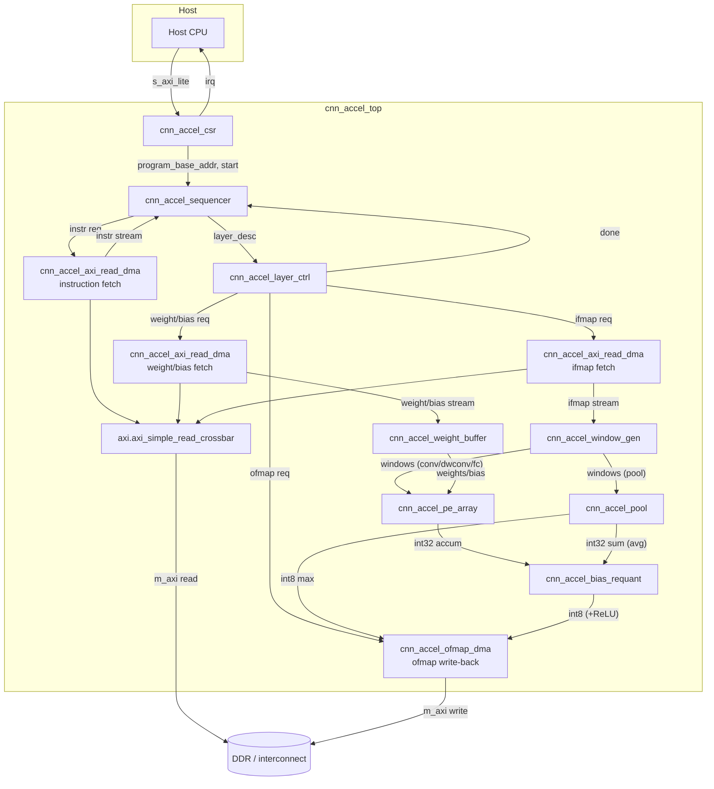

# CNN Accelerator — Architecture (`cnn_accel`, rev 1)

Input requirement: `doc/cnn_accel_req.md`.

## Layout note (deviation from the aspirational per-module layout)

`doc/canny_arch.md` documents a "one folder per module under `modules/`"
convention, but what is actually wired into `run.py` (`get_modules(...)`,
one VUnit library per top-level `modules/` folder) and actually populated
is a **single library per IP**: `modules/canny/{src,test,doc}` holds every
Canny entity, testbench and doc file, while the per-entity directories
(`modules/canny_window3x3/`, `modules/canny_top/`, ...) are empty, orphaned
stubs from an earlier, abandoned plan.

This architecture follows the convention that is **actually in effect**:
one new tsfpga module/library, `modules/cnn_accel/`, holding every entity
listed below under `modules/cnn_accel/src/*.vhd`, every testbench under
`modules/cnn_accel/test/*.vhd`, and every per-entity requirement/proposal/
doc file under `modules/cnn_accel/doc/<entity>_{req,proposal}.md` /
`modules/cnn_accel/doc/<entity>.md`. No empty per-entity stub directories
are created. `run.py` needs no changes: `get_modules(modules_folder=ROOT /
"modules")` already picks up any new top-level folder automatically.

This doc itself stays at the repo-level `doc/cnn_accel_arch.md`, mirroring
`doc/canny_arch.md`.

## Intent

A single-clock, memory-mapped CNN inference accelerator that fetches a
compiled instruction stream from DDR, executes each instruction (one CNN
layer) against int8 tensors resident in DDR, and writes results back to
DDR, using on-chip line buffers and a double-buffered weight cache as the
only on-chip storage. See `doc/cnn_accel_req.md` for full scope.

## VHDL revision policy

VHDL-2008, `ieee.std_logic_1164` / `ieee.numeric_std`. No VHDL-2019
constructs.

## Type policy

**Unresolved types** (`std_ulogic` / `std_ulogic_vector`) for every new
port and internal signal in this IP (user decision). This matches
`hdl-modules`' own packages (`axi_pkg`, `axi_lite_pkg`, `axi_stream_pkg`
all use `std_ulogic`/`std_ulogic_vector` throughout), so no
resolved/unresolved adaptation layer is needed at reuse boundaries.

## Interface record policy

Per `shared/InterfaceRecords.md` and to avoid re-deriving what
`hdl-modules` already provides, module boundaries that carry AXI4 /
AXI4-Lite / AXI4-Stream use `hdl-modules`' existing `m2s`/`s2m` record
types directly (`axi_pkg.axi_m2s_t`/`axi_s2m_t`,
`axi_lite_pkg.axi_lite_m2s_t`/`axi_lite_s2m_t`,
`axi_stream_pkg.axi_stream_m2s_t`/`axi_stream_s2m_t`). New internal,
non-AXI control buses (decoded instruction, DMA request/done) get their
own small `*_m2s_t`/`*_s2m_t` records in a new `cnn_accel_pkg.vhd`
(package, part of the `cnn_accel` library), per the same convention.

## Reset policy (deviation from resetless-by-default, justified)

The project default is resetless-by-default. This IP overrides that
default **for every stateful module**, for a documented reason: the host
must be able to abort a stuck or misbehaving program (bad instruction,
AXI error response, runaway loop-free-but-still-wrong descriptor) and
restart cleanly *without* a full FPGA reconfiguration. That is exactly the
"soft reset / subsystem restart" carve-out in `shared/FpgaInitialization.md`
condition 5 — state that must be runtime-restorable disqualifies
declaration-initial-value-only (resetless) registers.

Decision: every module in `modules/cnn_accel/` has a synchronous
active-high `reset` port. The top level combines two sources into one
internal reset tree:

```
reset_internal <= reset_external or soft_reset_pulse;
```

- `reset_external`: top-level `reset` input port (board/system reset).
- `soft_reset_pulse`: a one-cycle pulse generated by `cnn_accel_csr` when
  the host writes the `ABORT`/`SOFT_RESET` control-register bit, or when
  `cnn_accel_sequencer` latches a fatal error (bad opcode, AXI `SLVERR`/
  `DECERR`) — giving the host (or the accelerator itself) a way to force
  every submodule (sequencer PC, layer FSM, DMA engines, line buffers, PE
  array pipeline, weight buffer bank pointers) back to its idle state in
  one cycle.

`cnn_accel_csr` itself is the one exception worth calling out: its
register contents (program base address, IRQ mask, etc.) must survive a
*datapath* soft reset triggered by an error, so only its own soft-reset
*request* logic and IRQ/status bits are reset by `reset_external`; the
configuration registers are cleared only by `reset_external`, not by
`soft_reset_pulse` (otherwise an abort would erase the program address the
host is trying to re-launch). This asymmetry is recorded again in
`cnn_accel_csr`'s own requirement file.

## FPGA initialization capability

- Vendor/family: Xilinx 7-series / UltraScale (exact device TBD).
- Synthesis backend: TBD (Vivado assumed for the vendor flow; this project
  also carries a portable Yosys+GHDL path per `tsfpga-mcp`/`vhsynth` — no
  vendor primitives are used in v1, so both flows apply equally).
- Decision: **not used**. Every module in this IP needs the runtime,
  host-restorable reset described above (condition 5 of
  `shared/FpgaInitialization.md` is violated project-wide by design), so
  configuration-time initial values are not relied upon as a reset
  substitute anywhere in `modules/cnn_accel/`. BRAM/FF declaration initial
  values may still be present for simulation determinism, but every
  reset-bearing register also has an explicit reset branch.

## CDC

Single clock domain (`clk`) for the whole IP: host AXI4-Lite access, the
AXI4 master port to DDR/interconnect, and the internal datapath all run
synchronously to `clk`. **No CDC boundaries in v1.** If system integration
later requires the DDR-facing AXI4 port or the AXI4-Lite host port on a
different clock, the documented reuse candidates are `hdl-modules`
`axi.axi_read_cdc` / `axi.axi_write_cdc` (full AXI4) and
`axi_lite.axi_lite_cdc` (AXI4-Lite) — proven, predefined CDC modules
already vendored in this repo, per `shared/CdcPolicy.md`'s reuse-first
rule. Not instantiated in v1 since no second clock exists yet.

## Portability target

`PORTABLE_VHDL` throughout. No vendor primitives, attributes or hard IP in
v1. DSP48/BRAM **inference intent** (not instantiation) is noted per
module below for `vhsynth`/resource-estimation purposes:
- `cnn_accel_pe_array`: int8x int8 multiply-accumulate, int32 accumulate —
  DSP-inference intent (e.g. Xilinx DSP48E1/E2), one or more MACs per DSP
  depending on the vhdesign-time packing choice; not committed here.
- `cnn_accel_window_gen`, `cnn_accel_weight_buffer`: BRAM-inference intent
  for line buffers / weight banks.

## Instruction Set (v1)

Fixed-width **64-byte (16 x 32-bit word) descriptor**, byte-addressed,
naturally aligned, stored contiguously in DDR unless redirected by its own
`next_instr_addr` field (present from v1 so branching/looping can be added
later without an ISA break; the compiler always emits `next_instr_addr =
this_addr + 64` for straight-line programs today).

| Word | Bits | Field | Notes |
|---|---|---|---|
| W0 | [7:0] | `opcode` | `0x00 HALT`, `0x01 CONV2D`, `0x02 DWCONV2D`, `0x03 POOL_MAX`, `0x04 POOL_AVG`, `0x05 FC` |
| W0 | [15:8] | `flags` | bit0 `relu_en`, bit1 `bias_en`, bit2 `requant_en`, bit3 `pad_en`, bits4-7 reserved(0) |
| W0 | [31:16] | reserved | must be 0 |
| W1 | [31:0] | `in_addr` | DDR byte address, input activations |
| W2 | [31:0] | `out_addr` | DDR byte address, output activations |
| W3 | [31:0] | `weight_addr` | DDR byte address, weights (unused: `POOL_*`) |
| W4 | [31:0] | `bias_addr` | DDR byte address, bias (unused when `bias_en=0` or `POOL_*`) |
| W5 | [15:0]/[31:16] | `in_width` / `in_height` | input spatial dims, pixels |
| W6 | [15:0]/[31:16] | `in_channels` / `out_channels` | |
| W7 | [7:0]x4 | `kernel_h`,`kernel_w`,`stride_h`,`stride_w` | conv/dwconv window; `FC` uses `1,1,1,1` |
| W8 | [7:0]x4 | `pad_top`,`pad_bottom`,`pad_left`,`pad_right` | zero-padding, valid when `pad_en=1` |
| W9 | [31:0] | `requant_scale` | signed, Q15 fixed-point multiplier on the int32 accumulator |
| W10 | [7:0] | `requant_shift` | arithmetic right-shift applied post-multiply, pre-saturate |
| W11 | [7:0]x4 | `pool_kernel_h`,`pool_kernel_w`,`pool_stride_h`,`pool_stride_w` | `POOL_*` only |
| W12 | [31:0] | `next_instr_addr` | DDR byte address of the next instruction; program's own linear default is `+64` |
| W13-W15 | [31:0]x3 | reserved | must be 0 |

`FC` is decoded and executed identically to `CONV2D` with
`in_width=in_height=1`, `kernel_h=kernel_w=1` — a degenerate 1x1-spatial
convolution over the full input-channel vector, reusing the same
`cnn_accel_window_gen` + `cnn_accel_pe_array` + `cnn_accel_bias_requant`
datapath rather than a separate matrix-vector engine. This is the
architecture's main "avoid a second datapath" decision.

### Opcode support status, and who rejects the unsupported ones (decision D2)

`DWCONV2D` (`0x02`) has an allocated opcode but **no ratified weight
layout**. Depthwise has no cross-channel reduction — each output channel
depends on exactly one input channel — so the OHWI tile-major repacking
that `CONV2D`/`FC` use does not apply, and `cnn_accel_model.py`'s
`pack_weights_for_hw()` explicitly *rejects* the opcode rather than invent
an unratified layout. Consequently no per-tile weight byte length is
defined for it, and `cnn_accel_layer_ctrl` cannot compute one.

**Decision D2 (2026-09-07): rejecting unsupported operations is the
compiler's job, not the hardware's.** The compiler is the only component
that sees the whole network before anything executes, so it is where an
unsupported op can be reported against a source-level location instead of
as a runtime fault with no context. The accelerator therefore adds **no
`layer_error` path, no opcode-legality check and no defensive decode** for
this class of problem, and the RTL is not shaped around ops it does not
implement.

| Opcode | Status | Notes |
|---|---|---|
| `0x00 HALT` | supported | program terminator |
| `0x01 CONV2D` | supported | OHWI tile-major weights, `pack_weights_for_hw()` |
| `0x02 DWCONV2D` | **not supported** | opcode allocated, weight layout unratified; compiler must reject |
| `0x03 POOL_MAX` | supported | untiled (`OT = 1`) |
| `0x04 POOL_AVG` | supported | untiled; reuses `cnn_accel_bias_requant` for the divide |
| `0x05 FC` | supported | degenerate 1x1 `CONV2D`, see above |

**Contract for the compiler** (implemented in a separate repository):
emit only the opcodes marked supported above, and fail the build with a
diagnostic for anything else. The target backbone is all `CONV2D`, so
nothing in the current network is affected. If a future network needs
depthwise, ratifying its weight layout is a `vharch`/`vhdesign` task —
the open sub-question being whether to accept the simple
`(channels, K_h, K_w)` layout (per-tile length `K_h*K_w*g_pe_rows`, which
leaves the `g_pe_cols` dimension idle at roughly 1/8 MAC utilisation) or
to design a packing that maps spatial taps onto `g_pe_cols` (awkward for
3x3: 9 taps against 8 columns).

## Top-level generics

| Generic | Type | Default | Meaning |
|---|---|---|---|
| `g_axi_addr_width` | positive | 32 | `m_axi` address width |
| `g_axi_data_width` | positive | 64 | `m_axi` data width. **Bounded at 64 by decision D1** — see "Bus-width bound" below; asserted at elaboration in both DMA engines |
| `g_axi_id_width` | natural | 4 | `m_axi` ID width (>= ceil(log2(3)) for the 3 read requesters) |
| `g_axi_lite_addr_width` | positive | 8 | `s_axi_lite` register address width |
| `g_max_kernel_size` | positive | 7 | max supported conv/pool `K` (both dims) |
| `g_max_fmap_width` | positive | 1024 | max feature-map row width; sizes `cnn_accel_window_gen` line buffers |
| `g_line_buffer_channels` | positive | 1 | channels processed in parallel through the window generator |
| `g_pe_rows` | positive | 8 | `cnn_accel_pe_array` output-channel parallelism |
| `g_pe_cols` | positive | 8 | `cnn_accel_pe_array` input-channel/MAC parallelism per cycle |
| `g_accum_width` | positive | 32 | accumulator width |
| `g_weight_buffer_depth` | positive | 288 | elements in the (single, not ping-pong) weight region; `K^2 * ceil(C_max/8)` = `9*32` for the target backbone's worst layer (M7b) |
| `g_bias_buffer_depth` | positive | 8 | elements in the bias region, sized by `ceil(out_channels/g_pe_rows)` independently of the weight region (M7b) |
| `g_instr_word_bytes` | positive | 64 | instruction descriptor size (must match the ISA table above) |

## Top-level ports

| Port | Direction | Type | Meaning |
|---|---|---|---|
| `clk` | in | `std_ulogic` | single clock domain |
| `reset` | in | `std_ulogic := '0'` | synchronous active-high, external reset source |
| `s_axi_lite_m2s` | in | `axi_lite_pkg.axi_lite_m2s_t` | host control/status |
| `s_axi_lite_s2m` | out | `axi_lite_pkg.axi_lite_s2m_t` | host control/status |
| `m_axi_m2s` | out | `axi_pkg.axi_m2s_t` | AXI4 master to DDR/interconnect |
| `m_axi_s2m` | in | `axi_pkg.axi_s2m_t` | AXI4 master to DDR/interconnect |
| `irq` | out | `std_ulogic` | pulse/level on program done or fatal error (see `cnn_accel_csr`) |

## Submodule table

| Name | Responsibility | New / Reuse | Source |
|---|---|---|---|
| `cnn_accel_top` | Structural top: instantiate everything below, wire `s_axi_lite`/`m_axi`/`irq`, no datapath logic | new (structural only) | this IP |
| `cnn_accel_pkg` | Internal record types (`layer_desc_m2s_t`/`s2m_t`, `dma_req_m2s_t`/`s2m_t`) and opcode/flag constants from the ISA table | new | this IP |
| `cnn_accel_csr` | AXI4-Lite control/status registers: program base addr, start/abort, done/error/IRQ mask | new, generic wrapper around `register_file.axi_lite_register_file` | `hdl-modules/modules/register_file` |
| `cnn_accel_sequencer` | Instruction fetch (via a `cnn_accel_axi_read_dma` instance) + decode + program-counter + `HALT`/error detection; drives one `layer_desc` per instruction to `cnn_accel_layer_ctrl` | new | this IP |
| `cnn_accel_layer_ctrl` | Per-layer orchestration FSM: given a decoded `layer_desc`, sequences weight/bias fetch, ifmap fetch, datapath enable (conv/dwconv/fc vs pool, requant/ReLU), and output write-back; reports `done` to the sequencer | new | this IP |
| `cnn_accel_axi_read_dma` | Generic AXI4 read master -> internal AXI4-Stream; byte address + length in, stream of fixed-width beats out. Instantiated x3 (instruction fetch, weight/bias fetch, ifmap fetch) | new, built from reused AXI4 read-channel building blocks | new; internals reuse `axi.axi_read_pipeline`, `axi.axi_read_throttle` (`hdl-modules/modules/axi`) |
| `cnn_accel_ofmap_dma` | Output activation write-back: internal AXI4-Stream in -> AXI4 write master out | new, thin wrapper | `hdl-modules/modules/dma_axi_write_simple` |
| `cnn_accel_window_gen` | Configurable K_h x K_w / stride / zero-padding sliding-window generator over line buffers; generalizes the fixed-3x3 `canny_window3x3` pattern to arbitrary kernel/stride; used both for conv/dwconv/fc (feeding `cnn_accel_pe_array`) and pooling (feeding `cnn_accel_pool`), one instance per active use | new (architecturally informed by `modules/canny/src/canny_window3x3.vhd`, not reusable as-is: fixed 3x3, fixed border-dilation semantics specific to Canny) | this IP |
| `cnn_accel_weight_buffer` | **Single-buffered** streaming on-chip weight/bias cache (separate weight and bias regions, whole-row writes behind a shallow prefetch FIFO); filled once per output-channel pass by the weight `cnn_accel_axi_read_dma` instance, read by `cnn_accel_pe_array`/`cnn_accel_bias_requant`. Ping-pong was removed in M7b: per decision D6 weights are re-streamed from DDR4 per pass, and DDR4 bandwidth is not the constraint — on-chip footprint is (72 -> 15 BRAM) | new | this IP |
| `cnn_accel_pe_array` | int8 x int8 MAC array (parallelism `g_pe_rows` x `g_pe_cols`), int32 accumulation; executes `CONV2D`/`DWCONV2D`/`FC`. **Self-timed MAC pipeline** (S7): `c_mac_latency = 2 + c_tree_levels` cycles (5 at `g_pe_cols = 8`) from a group's address issue to its landing in `accum_q`, one adder-tree level per register stage; the latency costs once per output pixel, not once per MAC | new | this IP |
| `cnn_accel_pool` | Max/avg spatial reduction over `cnn_accel_window_gen` output; max path emits int8 directly, avg path emits an int32 sum for `cnn_accel_bias_requant` to scale/round | new | this IP |
| `cnn_accel_bias_requant` | int32 accumulator -> add bias -> multiply by `requant_scale` -> arithmetic shift by `requant_shift` -> saturate to int8 -> optional ReLU clamp; also used (bias=0) to round/scale `POOL_AVG` sums. **7-stage pipeline** (S7), one output beat per accepted input beat | new, generic wrapper composing reused primitives | `math.saturate_signed` (`hdl-modules/modules/math`); `math.truncate_round_signed` is *not* instantiated — the shift amount is a runtime value, so round-to-even is done inline with guard/sticky (see `modules/cnn_accel/doc/cnn_accel_bias_requant.md`) |

Reused directly at `cnn_accel_top` (no new wrapper, no new requirement
file — cited here per `shared/ReusableRTL.md`'s reuse-table convention):

| Name | Responsibility | Source |
|---|---|---|
| `axi.axi_simple_read_crossbar` | Arbitrates the 3 `cnn_accel_axi_read_dma` read masters (instruction, weight, ifmap) onto the single external `m_axi` read channel | `hdl-modules/modules/axi` |
| `axi_stream.axi_stream_fifo` | Elasticity buffering at internal AXI4-Stream links where DMA burst rate and consumer rate differ (instruction stream into the sequencer, ifmap stream into the window generator, weight stream into the weight buffer) | `hdl-modules/modules/axi_stream` |
| `common.handshake_mux` / `common.handshake_splitter` | Opcode-selected routing of `cnn_accel_window_gen`'s output stream to `cnn_accel_pe_array` (conv/dwconv/fc) vs `cnn_accel_pool` (pool), and convergence of `cnn_accel_bias_requant`'s output with `cnn_accel_pool`'s max-path output before `cnn_accel_ofmap_dma` | `hdl-modules/modules/common` |

The single external write requester (`cnn_accel_ofmap_dma`) connects
directly to `m_axi`'s write channels — no write-side crossbar needed (only
one writer).

## Block diagram



## Inter-module interface table

| Link | Protocol | Notes |
|---|---|---|
| `HOSTCPU <-> cnn_accel_csr` | AXI4-Lite | `s_axi_lite_m2s`/`s2m` |
| `cnn_accel_csr -> cnn_accel_sequencer` | new record, `layer_desc_pkg`-adjacent control bus | program base address, start pulse, abort/soft-reset pulse |
| `cnn_accel_sequencer -> cnn_accel_layer_ctrl` | new `layer_desc_m2s_t`/`s2m_t` (valid/ready) | one decoded instruction per handshake |
| `cnn_accel_layer_ctrl -> cnn_accel_sequencer` | `done : std_ulogic` pulse (+ `error : std_ulogic`) | layer complete / faulted |
| `cnn_accel_sequencer <-> cnn_accel_axi_read_dma` (instr) | new `dma_req_m2s_t`/`s2m_t` (addr/len/valid/ready) + AXI4-Stream result | one instruction descriptor per request |
| `cnn_accel_layer_ctrl <-> cnn_accel_axi_read_dma` (weight) | `dma_req_m2s_t`/`s2m_t` + AXI4-Stream | unused for `POOL_*` |
| `cnn_accel_layer_ctrl <-> cnn_accel_axi_read_dma` (ifmap) | `dma_req_m2s_t`/`s2m_t` + AXI4-Stream | always used |
| `cnn_accel_layer_ctrl <-> cnn_accel_ofmap_dma` | `dma_req_m2s_t`/`s2m_t` + AXI4-Stream | always used |
| `cnn_accel_axi_read_dma x3 -> axi.axi_simple_read_crossbar -> m_axi` | AXI4 (read channels only) | 3:1 arbitration, hdl-modules primitive |
| `cnn_accel_ofmap_dma -> m_axi` | AXI4 (write channels only) | direct, no arbitration (single writer) |
| `cnn_accel_axi_read_dma (weight) -> cnn_accel_weight_buffer` | AXI4-Stream | fills the single weight region; a `fill_start` pulse rewinds the fill address at the start of each output-channel pass |
| `cnn_accel_axi_read_dma (ifmap) -> cnn_accel_window_gen` | AXI4-Stream | raster-order int8 pixels, 1 (or `g_line_buffer_channels`) channel(s)/beat |
| `cnn_accel_window_gen -> cnn_accel_pe_array` / `cnn_accel_pool` | AXI4-Stream, `handshake_mux`-selected by opcode | one `K_h x K_w` window per beat |
| `cnn_accel_weight_buffer -> cnn_accel_pe_array` | simple read port (not AXI4-Stream: random-access within the active bank) | weights + bias |
| `cnn_accel_pe_array -> cnn_accel_bias_requant` | AXI4-Stream, `data` = int32 accumulator | |
| `cnn_accel_pool -> cnn_accel_bias_requant` (avg) / `-> cnn_accel_ofmap_dma` (max, via `handshake_mux`) | AXI4-Stream | mode-dependent width (int32 sum vs int8 max) |
| `cnn_accel_bias_requant -> cnn_accel_ofmap_dma` (via `handshake_mux` converging with pool-max) | AXI4-Stream, `data` = int8 | |

## Off-chip activation layout (decision S6)

Activations in DDR are stored as **channel-tiled planes**:

```
ofmap[c_tile][y][x][t]      c_tile = 0 .. ceil(C/T) - 1,  t = 0 .. T-1
byte offset = ((c_tile * H + y) * W + x) * T + t
```

with **`T` fixed at 8**, *independent of `g_pe_rows`*. A "plane" is one
`c_tile`: a complete `H x W x 8` HWC-ordered block covering channels
`8*c_tile .. 8*c_tile + 7`.

Why this layout, and what it costs:

- **Every write-back is contiguous.** This is the point. Under a flat HWC
  layout (`[H][W][C]`) a per-output-channel-tile pass produces only
  `g_pe_rows` of `C` channels at a time, which is a *strided* byte pattern;
  `dma_req_t` carries `addr` + `length` only, and neither it nor
  `cnn_accel_ofmap_dma`'s requirement can express a stride. This layout
  removes the need to: one pass over `T = 8` channels writes exactly one
  plane, start to finish, as a single contiguous range.
  **This resolves the strided-write-back blocker raised in the M8 entry of
  `modules/cnn_accel/flow_status.md`** — with no change to `dma_req_t` and
  with `cnn_accel_ofmap_dma` staying a thin `dma_axi_write_simple` wrapper.
- **`T` is decoupled from `g_pe_rows` on purpose.** Decision S1 makes
  `g_pe_rows` the only scaling knob (8 or 16, decision S4), and the memory
  layout must not change when it moves — otherwise every ofmap in DDR, and
  the host-side packing, would depend on which bitstream is loaded. A
  16-row pass therefore produces **two** planes and issues them as **two
  ordinary `dma_req`s**, not one double-length request.
- **Cost 1 (read side):** because the ifmap is stored the same way, and
  because the ifmap is always re-streamed per output-channel pass (decision
  D6, no on-chip ifmap buffer), `cnn_accel_layer_ctrl` must issue
  `ceil(C_in / 8)` read requests per ifmap row instead of one — the row's
  channels are spread across `ceil(C_in/8)` planes. This is bookkeeping in
  the layer FSM, not a new module.
- **Cost 2 (host side):** the network's final output is channel-tiled and
  the host repacks it once, at the end of a program. A one-off repack of
  the last tensor is cheap compared with either a strided DMA engine or a
  layout that changes with `g_pe_rows`.

`cnn_accel_window_gen`'s existing contract is unaffected: it still receives
raster-order beats of `g_tile_channels` channels, which is exactly one
plane's worth per beat when `g_tile_channels = T = 8`.

### Bus-width bound (decision D1)

Both DMA engines require `req.addr` and `req.length` to be multiples of
`g_axi_data_width / 8`, and **a violation is not reported** — the
under-length final chunk never completes, `dma_done` never fires, and the
layer hangs silently.

Because every activation request is a whole plane, `addr` and `length` are
always multiples of `T = 8` bytes. An AXI bus of at most 8 bytes per beat
is therefore aligned *unconditionally, for every layer geometry*. That is
enforced as a hard bound:

```
ACTIVATION_PLANE_CHANNELS = 8            -- T, cnn_accel_constants.py
MAX_AXI_DATA_WIDTH        = 8 * T = 64   -- bits
```

both propagated by `hdl-registers` into `cnn_accel_regs_pkg` and asserted
concurrently at `severity failure` in `cnn_accel_ofmap_dma` and
`cnn_accel_axi_read_dma` (the latter because the ifmap instance reads
planes too; the instruction and weight/bias instances would be safe at any
width, but all three share one top-level generic).

`ACTIVATION_PLANE_CHANNELS` is numerically equal to `g_tile_channels` and
deliberately a **separate constant**: `tile_channels` is a datapath
property (channels consumed per beat), `T` is a memory-layout property
(how host and DMA agree to pack DDR). Code meaning "the DDR layout" must
not read the datapath constant, so that a future decoupling fails to
compile rather than silently corrupting addresses.

The alternatives — a runtime alignment check in `cnn_accel_layer_ctrl`
raising `layer_error`, or a documented host contract with no hardware
check — were rejected: the general alignment predicate depends on runtime
descriptor fields (`out_width * out_height`) and so is not statically
checkable at all, whereas the bus-width bound is. **Accepted cost: 128-bit
AXI is forbidden**, capping burst bandwidth. Lifting the bound later means
adopting the runtime check, not merely widening the generic.

## Generic propagation map

- `g_axi_addr_width`, `g_axi_data_width`, `g_axi_id_width` -> every
  `cnn_accel_axi_read_dma` instance, `cnn_accel_ofmap_dma`,
  `axi.axi_simple_read_crossbar`.
- `g_axi_lite_addr_width` -> `cnn_accel_csr`.
- `g_max_kernel_size`, `g_max_fmap_width`, `g_line_buffer_channels` ->
  `cnn_accel_window_gen` (both conv-path and pool-path instances).
- `g_pe_rows`, `g_pe_cols`, `g_accum_width` -> `cnn_accel_pe_array`,
  `cnn_accel_bias_requant` (accumulator width).
- `g_weight_buffer_depth`, `g_bias_buffer_depth` -> `cnn_accel_weight_buffer`
  (forwarded unmodified through `cnn_accel_conv_core`).
- `g_instr_word_bytes` -> `cnn_accel_sequencer` (must equal the fixed ISA
  descriptor size), the instruction `cnn_accel_axi_read_dma` instance
  (default burst-length hint).

## Clock/reset domain map

Single domain: `clk` / `reset_internal` (see reset policy above) for every
module in `modules/cnn_accel/`, including all `cnn_accel_axi_read_dma` and
`cnn_accel_ofmap_dma` instances and the reused `hdl-modules` primitives
(`axi_simple_read_crossbar`, `axi_stream_fifo`, `fifo`, `handshake_mux`,
`handshake_splitter`, `axi_lite_register_file`, `dma_axi_write_simple`,
`saturate_signed`) — none of those reused primitives cross a clock domain
in this integration.

## Non-obvious boundary rationale

- **One generic `cnn_accel_axi_read_dma`, instantiated three times**
  (instruction, weight/bias, ifmap) rather than three bespoke read
  engines: the AXI4 read-master mechanics (AR issue, R backpressure,
  address/length bookkeeping) are identical; only the consumer differs
  (sequencer decode logic vs `cnn_accel_weight_buffer` vs
  `cnn_accel_window_gen`), and that consumer sits on the far side of a
  plain AXI4-Stream link.
- **`cnn_accel_window_gen` reused for both conv/dwconv/fc windows and
  pooling windows**: both are "K_h x K_w sliding window over line
  buffers with stride and optional zero padding" — the only difference is
  what consumes the window (`cnn_accel_pe_array` vs `cnn_accel_pool`), so
  that's an opcode-selected downstream mux, not two windowing
  implementations.
- **`FC` decoded as a degenerate 1x1-spatial `CONV2D`** (see ISA section):
  avoids a second matrix-vector datapath.
- **`cnn_accel_bias_requant` reused for `POOL_AVG` rounding**: an average
  pool's "divide by kernel area" is exactly a scale + arithmetic shift on
  an int32 sum, i.e. the same operation the requantizer already performs
  with `bias=0`, `requant_scale` set appropriately, and `requant_shift =
  log2(pool_kernel_h*pool_kernel_w)` when the pool area is a power of two
  (the common case); `POOL_MAX` bypasses it entirely since its output is
  already a valid int8 value.
- **`cnn_accel_sequencer` and `cnn_accel_layer_ctrl` kept separate**:
  different, independently testable responsibilities (program-counter/
  decode/halt-detection vs single-layer datapath orchestration); a layer
  descriptor can be fed to `cnn_accel_layer_ctrl` in isolation for its own
  VUnit testbench without a real instruction stream.
- **No write-side AXI4 crossbar**: only `cnn_accel_ofmap_dma` ever writes,
  so arbitration would be a no-op; `axi_simple_read_crossbar` is used on
  the read side only, where three requesters genuinely contend.

## Open items for `vhdesign`/`vhfill`

- Exact PE-array microarchitecture (output-stationary vs input-stationary,
  DSP packing of 2 int8 MACs per DSP48) — deferred, `g_pe_rows`/`g_pe_cols`
  only fix the generic shape here.
- Exact `axi_lite_register_file` register map (bit-level) for
  `cnn_accel_csr` — deferred to that module's own requirement file.
- Whether `cnn_accel_axi_read_dma`'s internal AXI4-Stream width equals
  `g_axi_data_width` or is narrowed to int8 lanes before reaching
  `cnn_accel_window_gen`/`cnn_accel_weight_buffer` — deferred to that
  module's requirement file (`width_conversion.vhd` in
  `hdl-modules/modules/common` is the reuse candidate if narrowing is
  needed).
